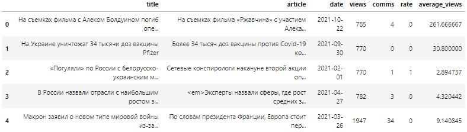
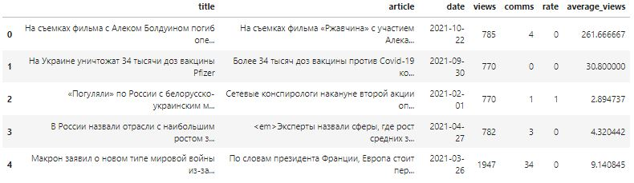

# Практический проект по сбору данных и работе с текстами
**Цель:**
В этом домашнем задании вам предстоит обойти все ловушки серверов, пробраться сквозь страницы html-код, собрать себе свой собственный датасет и натренировать на нём модель. 

**Часть 1. Парсинг**
</br>По аналогии с занятием, возьмите интересующий вас сайт, на котором можно пособирать какие-то данные (и при этом API не предоставляется). Идеальный датасет должен иметь текстовое описание некоторого объекта и некоторую целевую переменную, соответствующую этому объекту.

Например:
</br>*Сайт новостей:* текстовое описание - сама новость, целевая переменная - количество просмотров новости (можно поделить на число дней с момента даты публикации, чтобы получить “среднее число просмотров в день”)
</br>*Сайт с товарами/книгами/фильмами:* текстовое описание товара/книги/фильма + средний рейтинг в качестве целевой переменной
</br>*Блоги* - тексты заметок + число просмотров
</br>И любые другие ваши идеи, которые подходят под такой формат
Напишите свой парсер, который будет бегать по страничкам и автоматически что-то собирать. 

Не забывайте, что парсинг - это ответственное мероприятие, поэтому не бомбардируйте несчастные сайты слишком частыми запросами (можно ограничить число запросов в секунду при помощи time.sleep(0.3), вставленного в теле цикла)

**Часть 2. NLP**
</br>Разбейте собранные данные на train/test, отложив 20-30% наблюдений для тестирования. Примените tf-idf преобразование для текстового описания. Используйте как отдельные токены, так и биграммы, отсейте стоп-слова, а также слова, которые встречаются слишком редко или слишком часто (параметры min/max_df), не забудьте убрать l2 регуляризацию, которая по умолчанию включена. Если в вашем датасете целевая переменная непрерывная (например, среднее число просмотров в день), то воспользуйтесь линейной регрессией, если дискретная (положительный/отрицательный отзыв), то логистической. Постройте регрессию с настройкой параметра регуляризации, оцените качество при помощи соответствующих задаче метрик. Визуализируйте получившиеся коэффициенты регрессии (возьмите топ-50 слов). Проинтерпретируйте результаты.

**P.S.** Если с парсингом не задалось или данных собралось слишком мало - не отчаивайтесь, главное, что ваш парсер собрал хоть что-то! А для второй части задания можно скачать данные по отзывам на фильмы с сайта IMDB (https://www.kaggle.com/lakshmi25npathi/imdb-dataset-of-50k-movie-reviews), в которых для каждого отзыва поставлена семантическая оценка - "позитивный" или "негативный". 

```python
# Импорт библиотек по обработке интернет запросов
# и управлению Tor-подключениями
import requests
from stem import Signal
from stem.control import Controller

# Импорт библиотеки парсинга веб-страниц
from bs4 import BeautifulSoup

# Импорт библиотек по анализу и обработке информации
import pandas as pd
import re

# Импорт библиотек по обработке естественного языка
from nltk.tokenize import wordpunct_tokenize
from nltk.corpus import stopwords
import string
import pymorphy2

# Импорт библиотек по машинному обучению
from sklearn.model_selection import train_test_split
from sklearn.feature_extraction.text import TfidfVectorizer
from sklearn.linear_model import Ridge
from sklearn.metrics import r2_score

# Импорт библиотек по обработке дат и времени
import time
from datetime import datetime, timedelta

# Импорт системной библиотеки
from sys import stdout
```

## Часть 1. Парсинг
### Дополнительные функции
```python
# Функция создания сеанса подключенного к сети Tor
def get_session():
    # Создание сессии для отправки HTTP-запроса
    session = requests.Session()
    
    # Настраиваем прокси для отправки запросов через localhost:9050
    session.proxies = {'http': 'socks5://127.0.0.1:9050', 'https': 'socks5://127.0.0.1:9050'}
    
    return session

# Функция создания нового подключения к сети Tor
def renew_connection():
    with Controller.from_port(port=9051) as c:
        c.authenticate();
        c.signal(Signal.NEWNYM)

# Функция поиска гиперссылок на web-странице
def get_links(session, url_page):
    try:
        # Выполнение запроса на получение web-страниц
        response = session.get(url_page)
    except:
        renew_connection()
        return set()
    
    # Получение контента страницы в удобном формате
    soup = BeautifulSoup(response.content, 'html.parser')
    
    # Получение гиперссылок встречающихся на web-странице
    tags = soup.find_all('a', href=True)
    links = {get_root(url_page) + tag.get('href') for tag in tags}
    
    return links

# Функция определения корневой страницы сайта
def get_root(url_page):
    return re.findall(r'(http[s]{,1}://.*?)/', url_page)[0]

# Функция сбора данных с web-страницы
def get_content(session, url_page):
    try:
        # Выполнение запроса на получение web-страницы
        response = session.get(url_page)
    except:
        renew_connection()
        return {}
    
    # Получение контента web-страницы
    soup = BeautifulSoup(response.content, 'html.parser')
    
    try:
        # Извлечение заголовка новости
        title = soup.select_one('div.post-top > h1').get_text().strip()
        
        # Извлечение текста новости
        tags = soup.select('div.post > p')
        texts = [re.findall('<p>(.+)</p>', str(tag), re.DOTALL)[0] for tag in tags]
        
        # Извлечение даты публикации
        date_line = soup.select_one('div.link-block').get_text()
        date_value = ''.join(re.findall(r'(Сегодня)|(Вчера)|(\d{2}.\d{2}.\d{4})', date_line)[0])
        
        date_dict = {'Сегодня': datetime.strftime(datetime.now(), '%d.%m.%Y'),
                     'Вчера': datetime.strftime(datetime.now() - timedelta(days=1), '%d.%m.%Y')}
        
        date = re.sub('|'.join(date_dict.keys()), lambda x: date_dict[x.group()], date_value)
        
        # Извлечение количества просмотров
        views = soup.select_one('a.link-views > span[ckass=nd_span]').get_text().strip()
        
        # Извлечение количества комментариев
        comms = soup.select_one('a.link-comms > span[ckass=nd_span]').get_text().strip()
        
        # Извлечение рейтинга
        rate = soup.select_one('a.rate > span[ckass=nd_span]').get_text().strip()
        
        # Задержка для следующего запроса
        time.sleep(0.1)
        
        return {'title': title, 'article': ''.join(texts), 'date': date, 
                'views': int(views), 'comms': int(comms), 'rate': int(rate)}
    except:
        return {}

# Функция вывода выполнения процесса
def print_progress(text):
    stdout.write("\r" + text)
    stdout.flush()
```

### Сбор данных с сайта
```python
# Создание сеанса подключенного к сети Tor
session = get_session()

# Вывод информации о статусе подключения к сети Tor
print('IP адрес (текущий): ', requests.get('http://icanhazip.com').text.strip())
print('IP адрес (новый): ', session.get('http://icanhazip.com').text.strip())
```
```
IP адрес (текущий):  185.30.229.98
IP адрес (новый):  192.160.102.170
```

```python
# Новостной сайт для парсинга и последующего анализа
URL = 'https://newsland.com/'

# Получение ссылок на новостные страницы сайта
links = set()
for i in range(900):
    links = links.union(get_links(session, '{}newsland?page={}'.format(URL, i)))
    
    # Вывод количества обработанных лент
    print_progress('Обработано новостных лент {} из {}'.format(i + 1, 900))

# Вывод количества ссылок на новостные страницы
print('\nКоличество ссылок на новостные страницы:', len(links))
```
```
Обработано новостных лент 900 из 900
Количество ссылок на новостные страницы: 19153
```

```python
# Коллекция данных собранных с web-страниц
site_data = []

# Получение данных из новостных страниц
for link, i in zip(links, range(len(links))):
    content = get_content(session, link)
    if not content=={}:
        site_data.append(content)
    
    # Вывод количества обработанных страниц
    print_progress('Обработано новостных страниц {} из {}'.format(i + 1, len(links)))
```
```
Обработано новостных страниц 19153 из 19153
```

### Сохранение данных
```python
# Создание датасета данных
newsland_data = pd.DataFrame(site_data)

# Преобразование даты в соответствующий тип
newsland_data['date'] = pd.to_datetime(newsland_data.date, dayfirst=True)

# Определение среднего числа просмотров статьи в день
newsland_data['average_views'] = newsland_data.views / ((newsland_data.date.max() - newsland_data.date).dt.days + 1)

# Сохранение собранной информации
newsland_data.to_csv('newsland.csv', index=False)

# Вывод датасета
newsland_data.head()
```


## Часть 2. NLP
### Загрузка исходных данных
```python
# Загрузка ранее собранной информации
newsland_data = pd.read_csv('newsland.csv', index_col=False)

# Вывод датасета
newsland_data.head()
```


### Предобработка данных
```python
# Определение списка стоп-слов
stop_words = stopwords.words('russian')
stop_words += ['10', '2021', 'rel', 'br', 'nofollow', 'em']

# Список токенезированых статей
articles = []

# Разбиение текста статей на токены и исключение из них стоп-слов
for item in newsland_data.article.values:
    tokens = wordpunct_tokenize(str(item).lower())
    tokens = [word for word in tokens if (word not in string.punctuation) and (word not in stop_words)]
    articles.append(tokens)
    
    # Вывод прогресса токенизации статей
    print_progress('Обработано новостных текстов {} из {}'.format(len(articles), len(newsland_data.article.values)))
```
```
Обработано новостных текстов 17815 из 17815
```

```python
# Инициализация морфологического анализатора
morph = pymorphy2.MorphAnalyzer()

# Список лемматизированных статей
articles_norm = []

# Приведение словоформ (токенов) статей к словарной форме
for article in articles:
    words_norm = [morph.parse(word)[0].normal_form for word in article]
    articles_norm.append(' '.join(words_norm))
    
    # Вывод прогресса лемматизации статей
    print_progress('Обработано новостных текстов {} из {}'.format(len(articles_norm), len(articles)))
```
```
Обработано новостных текстов 17815 из 17815
```

### Векторное представление слов
```python
# Разбиение данных на тренировочную и тестовую выборки
Texts_train, Texts_test, Y_train, Y_test = train_test_split(
    articles_norm, newsland_data.average_views.values, random_state=42)

# Создание модели TF-IDF для токенов и оценка их важности в контексте документа
vectorizer_tokens = TfidfVectorizer(max_features=250, min_df=0.1, max_df=0.8)
X_train_tokens = vectorizer_tokens.fit_transform(Texts_train)
X_test_tokens = vectorizer_tokens.transform(Texts_test)

# Создание модели TF-IDF для биграмм и оценка их важности в контексте документа
vectorizer_bigram = TfidfVectorizer(max_features=250, min_df=0.1, max_df=0.8, ngram_range=(2, 2))
X_train_bigram = vectorizer_bigram.fit_transform(Texts_train)
X_test_bigram = vectorizer_bigram.transform(Texts_test)
```

### Построение моделей
```python
# Построение модели линейной регрессии
model = Ridge(random_state=42).fit(X_train_tokens, Y_train)

# Предсказание среднего количества просмотров
Y_pred = model.predict(X_test_tokens)

# Вывод метрики качества модели прогноза
print('Коэффициент детерминации модели: {:.4f}'.format(r2_score(Y_test, Y_pred)))
```
```
Коэффициент детерминации модели: 0.0046
```

```python
# Вывод коэффициентов регрессии для признаков модели
feature_ranks = pd.Series(model.coef_, vectorizer_tokens.get_feature_names())
feature_ranks = feature_ranks.sort_values(ascending=False)
feature_ranks.head(20)
```
```
иностранный    75.423231
средство       71.421520
месяц          66.628797
просто         49.845101
информация     42.336192
решить         38.110195
хотя           37.833496
лишь           36.842427
конец          36.592628
пресс          35.917799
александр      33.626908
вопрос         33.459508
случай         30.625850
находиться     30.499139
сергей         29.518823
рост           29.078614
данные         25.650603
мнение         25.007401
итог           24.522596
сам            24.437350
dtype: float64
```

```python
# Вывод примера результатов предсказания
for i in range(3):
    print('\033[1m' + 'Истинное среднее число просмотров:' + '\033[0m' + ' {:.00f}'.format(Y_test[i]))
    print('\033[1m' + 'Предсказанное среднее число просмотров:' + '\033[0m' + ' {:.0f}'.format(Y_pred[i]))
    print('\033[1m' + 'Текст новости:' + '\033[0m' + ' {}...\n'.format(Texts_test[i][:200]))
```
```
Истинное среднее число просмотров: 135
Предсказанное среднее число просмотров: 33
Текст новости: компания facebook объявить намерение привлечь разработка собственный версия « интернет будущее » тысяча человек евросоюз следующий пять год ес планироваться нанять 000 человек который заняться разрабо...

Истинное среднее число просмотров: 20
Предсказанное среднее число просмотров: 33
Текст новости: рост цена падение доход вынуждать россиянин затягивать пояс треть гражданин 31 %) экономить еда каждый второй 42 %) – одежда обувь каждый пятый 17 %) – медикамент 27 россиянин начать экономить год пок...

Истинное среднее число просмотров: 37
Предсказанное среднее число просмотров: 29
Текст новости: украинский президент владимир зеленский « воля » желание лично встретиться российский коллега владимир путин любой время любой нейтральный территория заявить пресс секретарь украинский президент серге...

```

```python
# Построение модели линейной регрессии
model = Ridge(random_state=42).fit(X_train_bigram, Y_train)

# Предсказание среднего количества просмотров
Y_pred = model.predict(X_test_bigram)

# Вывод метрики качества модели прогноза
print('Коэффициент детерминации модели: {:.4f}'.format(r2_score(Y_test, Y_pred)))
```
```
Коэффициент детерминации модели: 0.0041
```

```python
# Вывод коэффициентов регрессии для признаков модели
feature_ranks = pd.Series(model.coef_, vectorizer_bigram.get_feature_names())
feature_ranks = feature_ranks.sort_values(ascending=False)
feature_ranks.head(20)
```
```
ru tags           -3.989030
владимир путин    -4.300498
https www         -5.299966
2020 год          -5.636749
ru news           -8.289777
href https       -10.295105
href http        -14.727109
dtype: float64
```

```python
# Вывод примера результатов предсказания
for i in range(3):
    print('\033[1m' + 'Истинное среднее число просмотров:' + '\033[0m' + ' {:.00f}'.format(Y_test[i]))
    print('\033[1m' + 'Предсказанное среднее число просмотров:' + '\033[0m' + ' {:.0f}'.format(Y_pred[i]))
    print('\033[1m' + 'Текст новости:' + '\033[0m' + ' {}...\n'.format(Texts_test[i][:200]))
```

```
Истинное среднее число просмотров: 135
Предсказанное среднее число просмотров: 33
Текст новости: компания facebook объявить намерение привлечь разработка собственный версия « интернет будущее » тысяча человек евросоюз следующий пять год ес планироваться нанять 000 человек который заняться разрабо...

Истинное среднее число просмотров: 20
Предсказанное среднее число просмотров: 33
Текст новости: рост цена падение доход вынуждать россиянин затягивать пояс треть гражданин 31 %) экономить еда каждый второй 42 %) – одежда обувь каждый пятый 17 %) – медикамент 27 россиянин начать экономить год пок...

Истинное среднее число просмотров: 37
Предсказанное среднее число просмотров: 29
Текст новости: украинский президент владимир зеленский « воля » желание лично встретиться российский коллега владимир путин любой время любой нейтральный территория заявить пресс секретарь украинский президент серге...
```

## Выводы и результаты
Из полученных результатов можно сказать, что модель линейной регрессии построенной для токенов и биграмм дает одинаково плохие результаты. Модель не смогла найти статистическую связь между текстом новостей и средним количеством просмотров, что подтверждается низким значением коэффициента детерминации. Допускаю, что выбранная модель оценки важности слов TF-IDF в данном случае не подходит и стоит рассмотреть модель Bag of Words.
